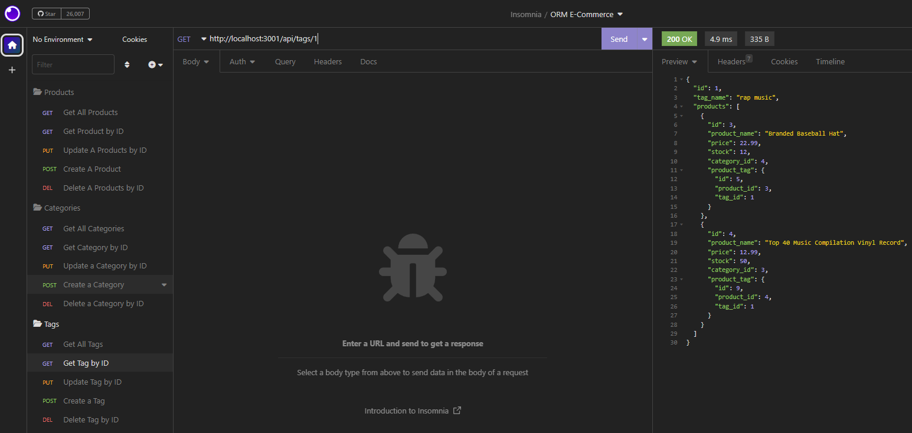

# ORM-E-Commerce-BackEnd

[Link to my profile](https://github.com/cujion)

## Table of Contents
- [Description](#description)
- [Visuals](#visuals)
- [Tests](#tests)
- [License](#license)

## Description
* This application is a Object-Relational Mapping (ORM) E-Commerce Back End. In this application you learn how to setup a mysql database using sequelize. You define your different models for each table inside your database and use an index.js file to define your relationships between each table. Once you have that all setup then you get into setting up your routes for each data table. This is where you define which actions you would like to perform. For example a findAll function to get all the specified data with in a specific table inside your database. You can also find by a specific id, create a new item inside a table, update an item inside a table or delete an item inside a table.

## Visuals

## License
* MIT License

* Copyright (c) [2022]] [Christopher Bonime]

* Permission is hereby granted, free of charge, to any person obtaining a copy
of this software and associated documentation files (the "Software"), to deal
in the Software without restriction, including without limitation the rights
to use, copy, modify, merge, publish, distribute, sublicense, and/or sell
copies of the Software, and to permit persons to whom the Software is
furnished to do so, subject to the following conditions:

* The above copyright notice and this permission notice shall be included in all
copies or substantial portions of the Software.

* THE SOFTWARE IS PROVIDED "AS IS", WITHOUT WARRANTY OF ANY KIND, EXPRESS OR
IMPLIED, INCLUDING BUT NOT LIMITED TO THE WARRANTIES OF MERCHANTABILITY,
FITNESS FOR A PARTICULAR PURPOSE AND NONINFRINGEMENT. IN NO EVENT SHALL THE
AUTHORS OR COPYRIGHT HOLDERS BE LIABLE FOR ANY CLAIM, DAMAGES OR OTHER
LIABILITY, WHETHER IN AN ACTION OF CONTRACT, TORT OR OTHERWISE, ARISING FROM,
OUT OF OR IN CONNECTION WITH THE SOFTWARE OR THE USE OR OTHER DEALINGS IN THE
SOFTWARE.